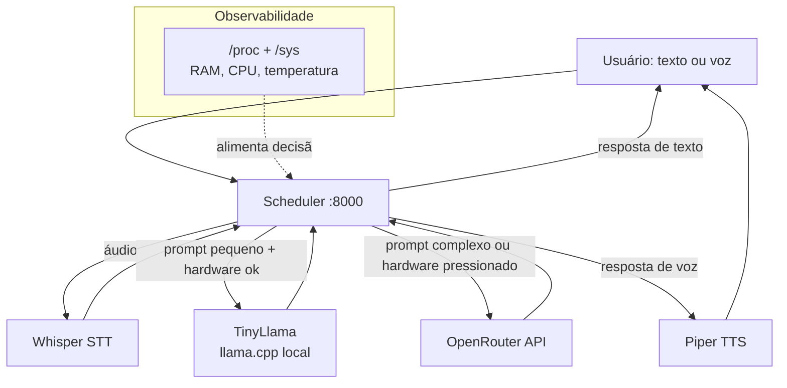
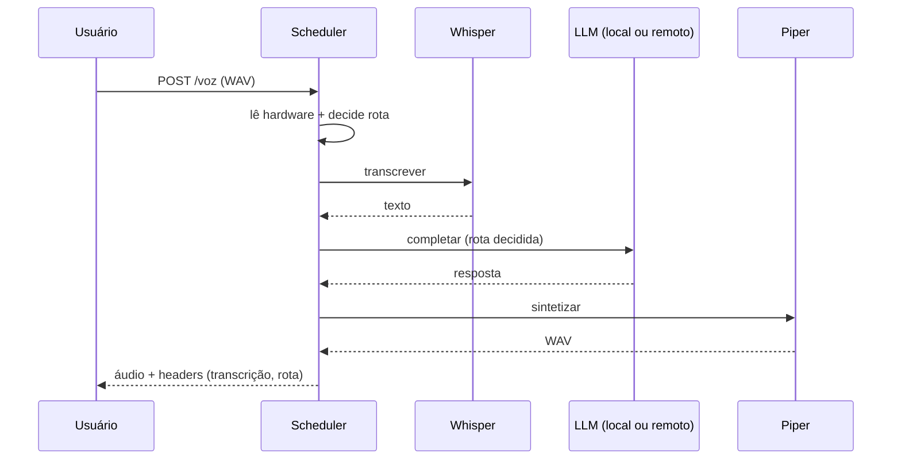

# Arquitetura

O sistema segue camadas simples, com o Scheduler como único cérebro:

## Fluxo de uma requisição de voz

## Regras de decisão

| Condição | Rota |
|---|---|
| Entrada é áudio | Pipeline de voz |
| ≤ 280 chars, sem palavra-chave complexa, RAM ≥ 500MB, CPU < 90%, temp < 75°C | TinyLlama local |
| Complexo OU hardware pressionado (com OpenRouter configurado) | OpenRouter |
| Falha do local | Fallback → OpenRouter |

Decisões registradas em log JSON estruturado (rota, motivo, latência, fallback).
Histórico de decisões de arquitetura em `docs/adr/`.
